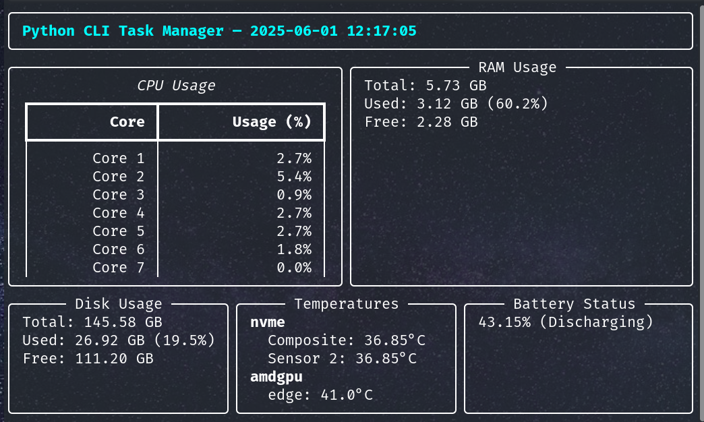

🖥️ Python CLI Task Manager

A real-time, terminal-based system monitor built in Python. It displays live updates of:

    ✅ CPU usage (per core & total)

    ✅ RAM usage

    ✅ Disk usage

    ✅ Battery status

    ✅ System temperature

Powered by the rich library for a beautiful and responsive CLI UI.
📸 Screenshot



📦 Requirements

Install required Python packages using pip:
```bash
pip install psutil rich
```

🚀 How to Run

    Save the script as task_manager.py

    Run it from your terminal:

python task_manager.py

You will see a live-updating dashboard right in your terminal!

🔄 Features

    Live auto-refresh every second (like htop)

    Scroll-free layout using rich.live.Live

    Works on Windows, Linux, and macOS

    Graceful exit with Ctrl+C


#❗ Notes
|
|    Temperature sensors may not be supported on all platforms (e.g., some laptops or virtual machines).
|
|    Battery status will not show on desktop systems without a battery.

